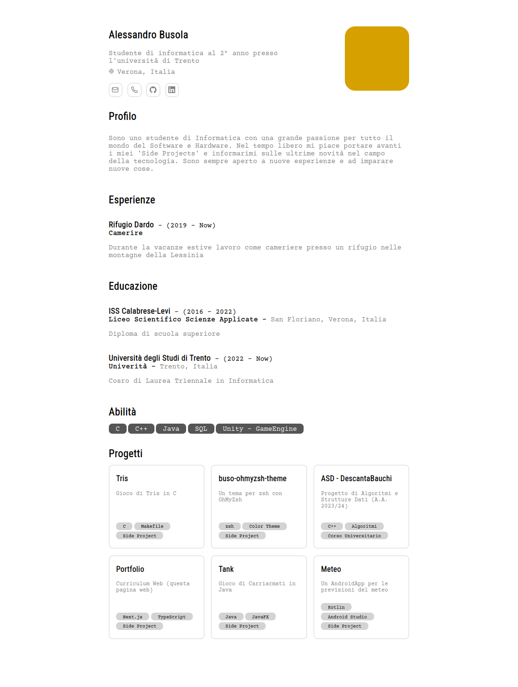

# Portfolio

Welcome to my minimalist web-based curriculum vitae repository.  This project showcases my professional journey with a clean and print-friendly layout. Below are the key features and instructions for exploring it.

## Features
- **Built using:**
    - Next.js 14
    - React
    - Typescript 
    - CSS
- **Print-friendly design**
- **Minimalist aesthetic**

## How to View
You can explore my CV [Online](https://github.com/ilBuso/Portfolio), or explore it locally following these steps:
1. Clone the repository:
```bash
git https://github.com/ilBuso/Portfolio.git
cd Portfolio
```
2. Install dependencies:
```bash
npm install
```
3. Start the local server:
```bash
npm run dev
```
4. Open your web browser and enter the following URL:
```url
http://localhost:3000/
```
Feel free to navigate through the different sections and learn more about my professional background in a minimalist and easy-to-read format.

### Screenshot

If you encounter any issues accessing the website, here's a screenshot:


